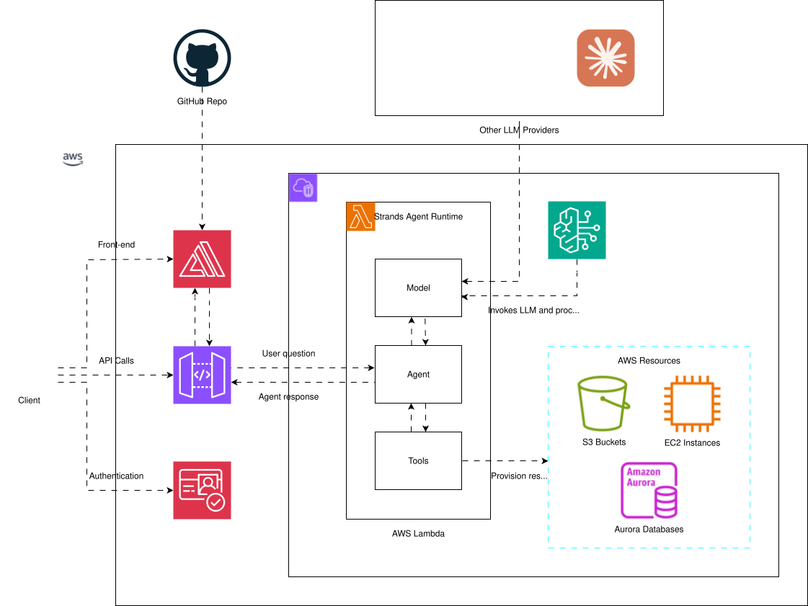

# 🚀 AWS CloudOps Agent

A beginner-friendly AWS operations agent built with AWS Strands Agent SDK and  Amazon Bedrock Claude 4 Sonnet.

## ✨ Features

- 📊 **AWS Resource Discovery**: Query your AWS resources and services
- 🏗️ **Architecture Design**: Get architecture recommendations based on your scenarios
- 💡 **Best Practices**: Receive AWS best practices and security recommendations
- 🔍 **Troubleshooting**: Get help with AWS-related issues
- 🎨 **User-Friendly Interface**: Rich console interface with emojis and visual indicators

## 🏛️ Initial Architecture



## 🛠️ Setup

### Prerequisites

- Python 3.11+
- AWS CLI configured with appropriate credentials
- uv package manager
- Docker

### Installation

1. Clone or navigate to the project directory:

```bash
cd C:\\ws\\aws-cloudops-agent

```

2. Install dependencies:

```bash
uv sync

```

3. Configure AWS credentials:

```bash
aws configure

```

## 🚀 Usage

Run the agent:

```bash
uv run \\src\\agent_cli.py

```

### Example Interactions

**Resource Discovery:**

```sh
You: Show me my EC2 instances
Agent: 📊 Here are your EC2 instances...

```

**Architecture Design:**

```ini
You: Design a web app architecture for high availability
Agent: 🏗️ For a highly available web application, I recommend...

```

**Best Practices:**

```yaml
You: What's the best way to store user data securely?
Agent: 🔒 For secure user data storage, consider these options...

```

## 📁 Project Structure

```ini
aws-cloudops-agent/
├── src/
│   ├── agent_cli.py                    # CLI entry point
│   ├── agent_fastapi.py                # FastAPI web interface
│   ├── aws_cloudops_agent.py           # Main agent implementation
│   ├── deploy_agent.py                 # Agent deployment utilities
│   └── invoke_agent.py                 # Agent invocation utilities
├── assets/
│   ├── AgentRuntimeRole.json           # AWS IAM role configuration
│   ├── assume-role-policy.json         # Role assumption policy
│   ├── simple-trust-policy.json        # Simple trust policy
│   └── trust-policy.json               # Trust policy configuration
├── docs/
│   ├── AWS-CloudOps-Agent.pptx         # Presentation
│   ├── aws-strands-agent.drawio        # Architecture diagram
│   ├── aws-strands-agent.drawio.svg    # Architecture diagram (SVG)
│   └── ROADMAP.md                      # Project roadmap
├── dockerfile                          # Docker configuration
├── pyproject.toml                      # Project configuration
├── requirements.txt                    # Dependencies
├── uv.lock                             # Dependency lock file
└── README.md                           # This file
```

## 🤝 Contributing

This is a minimal implementation focused on simplicity and user experience. Feel free to extend with additional features!

## 📝 License

MIT License - feel free to use and modify as needed.